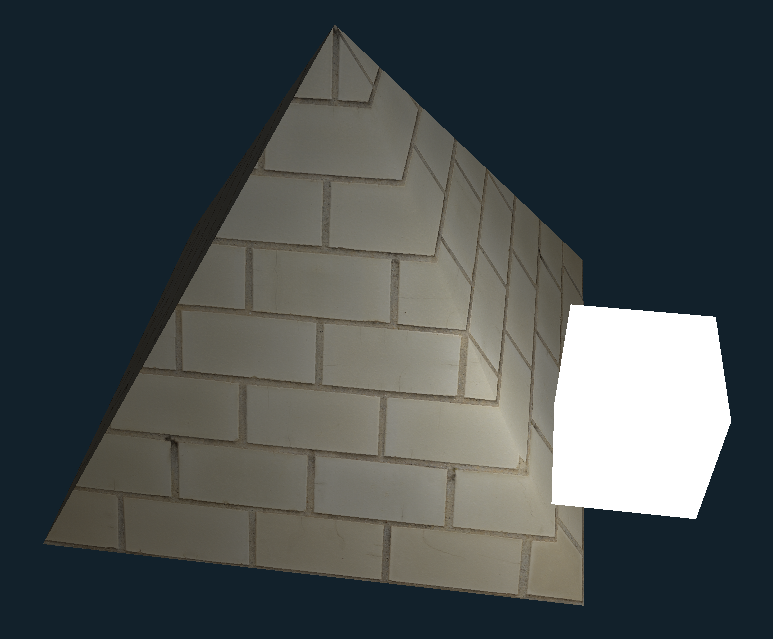

# SimpleGL

My journey to learning OpenGL. This repository includes the wrappers I made during learning it.

I'm using this tutorial by [Victor Gordan](https://github.com/VictorGordan):
https://www.youtube.com/playlist?list=PLPaoO-vpZnumdcb4tZc4x5Q-v7CkrQ6M-

Although the code is not exactly the same, I only used it to
learn which GL functions are called and when to call them. Then I made a wrapper around them myself. The biggest
similarity is in the shaders.

This is a no contribution repository. I made it for myself to learn OpenGL and track my progress. Most importantly, this
repository doesn't contain any AI generated code.

